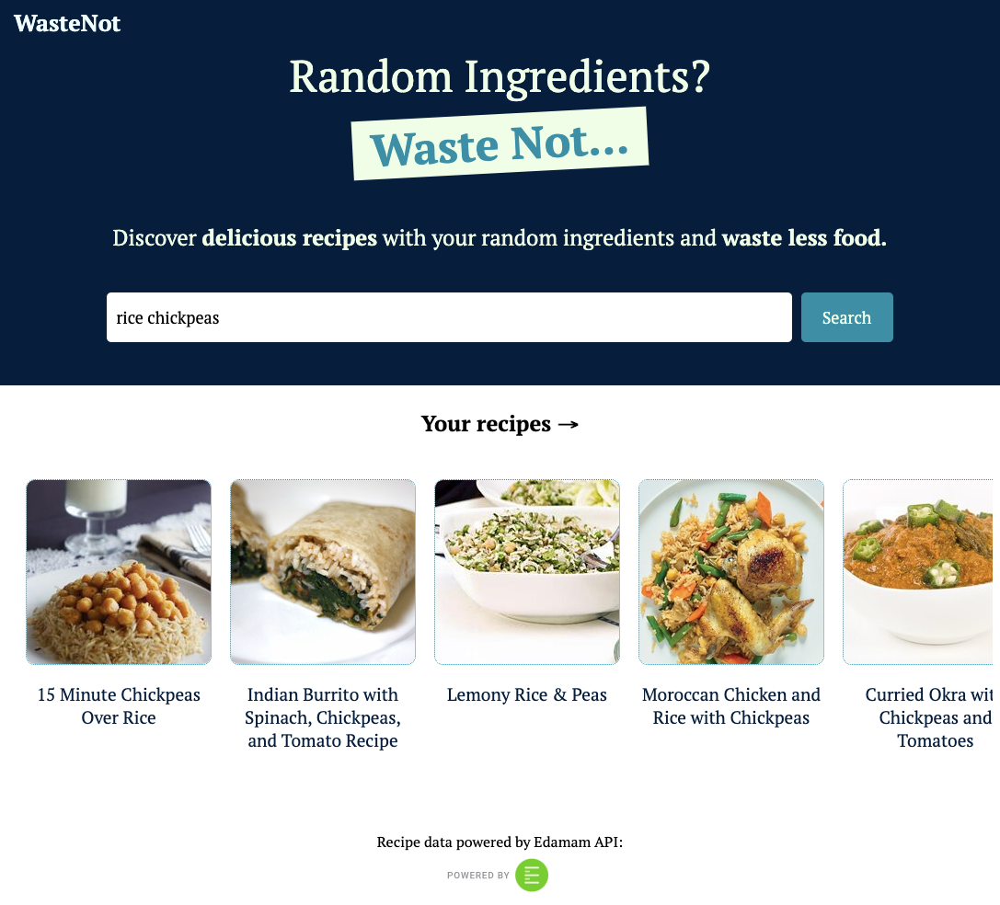
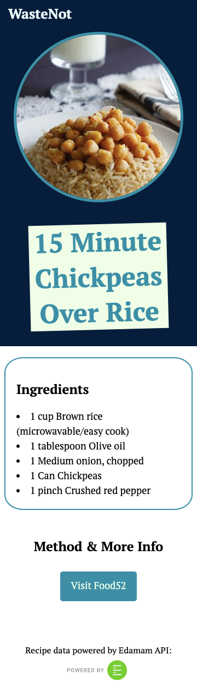

# WasteNot

WasteNot is a web application that helps users discover recipes based on ingredients they need to use up. 

I had the idea for WasteNot because I **love food** and **hate waste**.

**Live site:** https://waste-not-app.vercel.app/

## Tech Stack
- **Client:** React.js, TypeScript, modular CSS, Vercel
- **Server:** Node.js, Express.js, Edamam API, Render, Postman

## V1 Features
In my first iteration of WasteNot, users can:
- Search for recipes based on any number of ingredient inputs
- See a full list of ingredients for a recipe by clicking on it

## V1 Screenshots

